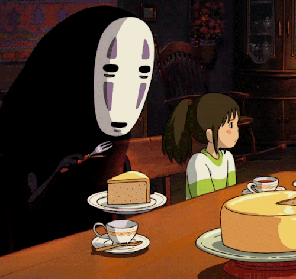
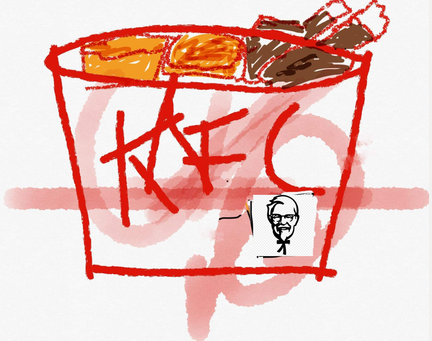

Hemos visto algunas habilidades que se deben cultivar para el diseño de juegos pero ¿Cuál es el objetivo de un diseñador de juegos?. La respuesta parece trivial: diseñar juegos. En realidad, esa no es la respuesta correcta. El diseñador de juegos debe propiciar que los jugadores tengan una experiencia "mágica" sin importar cual sea el medio en el que se desarrolle el juego.

**Sin la experiencia, el juego no tiene valor**   

## Persiguiendo el arcoiris
Crear juegos que de alguna manera generen experiencias asombrosas, convincentes y asombrosas es aun un tema del misterio de la mente humana y los secretos de su corazón. Diferentes campos disciplinares han abordado parte de este gran mapa. 

## Psicología
- Investiga la naturaleza de la experiencia humana y los mecanismos que gobiernan la mente humana.
 - Hay enfoques como el conductista que hacen mediciones usando un tipo de cajas negras para estudiar la mente.  
  {width=50%}

  - Otro enfoque es el método de introspección fenomenológica, el cual es completamente subjetivo. Por lo tanto, las experiencias no pueden ser medidas directamente, solo pueden ser descritas y de forma incompleta.  
  {width=75%}
 - Aunque la psicología no ofrece todas las respuestas que se necesitan en el diseño de juegos, sí ofrece algunas muy importantes.
 
 ## Antropología  
 - Tiene un efoque mucho más holístico que la psicología debido a que comprende aspectos físicos, mentales y culturales de las personas para comprender sus pensamientos y lo que hacen.
 - Podemos aprender un gran número de cosas sobre la naturaleza humanda desde la perspectiva del trabajo antroplógico
 
 ## Diseño  
 - A diferencia de los científicos, los diseñadores rara vez publican sus descubrimientos.
 - A menudo los mejores diseñadores conocen muy poco de sus trabajos en otras áreas del diseño.
 - La tarea del diseño de juegos es sumamente dificil dado que no se puede ser snob en donde se obtiene el conocimiento. Laas ideas vienen de cualquier parte.  
 ## Introspección: Poder, Peligros y Práctica 
 Algo en común que tienen las tres disciplinas descritas anteriormente es la *introspección*, es decir, el acto de examinar los propios pensamientos y sentimientos, estas son nuestras experiencias.
        {width=25%}

### Riesgo #1: La Introspección puede conducir a Falsas Conclusiones sobre la Realidad
- Sócrates notó que cuando aprendemos algo nuevo, a menudo creemos que ya teníamos conocimientos previos sobre el tema y que lo habíamos olvidado, de ahí que la idea de reencarnación tomará fuerza.
- El que alguien sienta que algo es real, no significa que esto sea real.
- Es muy fácil que las personas caigan en esta trampa.
- Cuando tratamos con el corazón y la mente humana, e intentamos entender la experiencia y lo que las cosas hacen sentir, la introspección es una herramienta poderosa y confiable.

### Riesgo #2: Lo que es verdad de mi experiencia puede no ser la de otras personas
- "Me gusta jugar este juego, y por lo tanto debe ser bueno"
- "Sólo diseñaré juegos para personas como yo"
- Dificilmente se diseña un juego por solo una persona.
- Hay muchos tipos de juegos y audiencias que estarán fuera de nuestros límites.

## Disecciona tus sentimientos
## **Ejercicio 1:** Describe qué es lo que recuerdas de tu desayuno de hoy. ¿Que sensaciones recuerdas?, ¿Qué sentimientos recuerdas al consumirlo? ## 
Desayune 1 huevo estrellado, 2 quesadillas y una tercera parte de milanesa. Esta comida la hizo mi hermano menor, a el le gusta cocinar a pesar de que generalmente deja un chingo de humo en la cocina, que fue el caso de hoy, y cocina bien, sabe como me gusta el huevo, bien cocido, las quesadillas eran de tortilla de maíz simples pero combinaban bien con el huevo y pues el pedazito de milanesa lo dejé para el final porque es mi parte favorita. Recuerdo que cuando estaba cocinando me puse de mal humor por la humarada y porque tenía hambre. Pero ya comiendo me pude relajar, sentía gratitud porque el ha estado haciendo la comida. También recuerdo como crujía la tortilla de la quesadilla y como tuve que batallar un poco para masticar la esquina de la milanesa.

  
## Ejercicio 2: Ve el siguiente [Video 1](https://youtu.be/w7WEfAjbHy0) y responde las siguientes preguntas: ##

**1. ¿Cuál fue el platillo que produjo un sentimiento de agrado más fuerte y por qué?**

El pay que come el sin cara cuando esta con Chihiro y la señora cabezona, en general soy muy fan de los pays y ese parecía tener una textura
muy esponjosa. El pastel de queso es mi postre favorito.

  
**2. ¿Cuál fue el platillo que produjo un sentimiento de desagrado más fuerte y por qué?**

Investigue un poco y al parecer es estomago de cordero o ba wan, tanto en la representación de Ghibi como en la presentación "real" en caso de que fuera estomago de cordero no me agradó visualmente pero me da la impresión de que si me gustaría el sabor en la presentaciónq que fuera.

**3. Crea una breve historia con al menos 2 platillos del video (100 palabras)**

Arturo era un niño de 10 años que vivía con su papá, como su papá estaba muy ocupado para preparar el desayuno Arturo tenía que preparar su 
propio desayuno y lo único que sabía hacer era huevo estrellado, aunque desayunaba siempre huevo estrellado el no se quejaba ya que esperaba los
domingos para poder desayunar filete de res con su papá, los domingos eran sus días favoritos ya que podía comer su platillo favorito y comía acompañado.

**4. Haz un dibujo de algun platillo que tenga un significado especial para ti y escribe brevemente por qué.**

Cuando era muy chico, creo unos 3 o 4 años, casi no comía, estaba enfermo de la garganta y tenía que ir al "doctor" por una inyección frecuentemente 
y en Coacalco el "doctor" estaba justo en frente del KFC así que ibamos a comer y recuerdo que era lo único que si comía, como estaba chico no recuerdo
mucho de que se trata pero si recuerdo que el ambiente dentro del KFC era muy agradable. Hoy en día y aún a sabiendas de que es comida muy poco nutritiva
sigue siendo de mis comidas favoritas y nunca le digo que no.

## Derrotando a  Heisenberg
¿Cómo podemos observar nuestras propias experiencias sin echarlo a perder, dado que el acto de observación es en sí una experiencia?. Intenta observar tus dedos cuando estas haciendo algo, por ejemplo tecleando y notarás como lo haces más lenteo y cometiendo varios errores. Trata de observarte mientras disfrutas un juego o una película y notarás como esa sensación disminuye. Algunos llaman a esto *"la parálisis por análisis"* o el *"Principio de Heisenberg"*.
El principio de incertidumbre de Heisenberg proviene de la mecánica cuántica donde se establece que no puede observar el movimiento de una partícula sin alterarlo.
