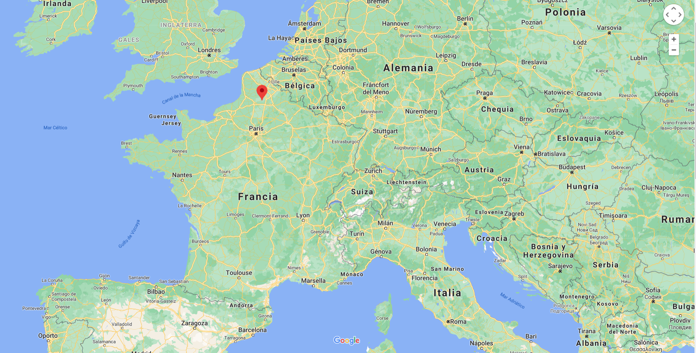
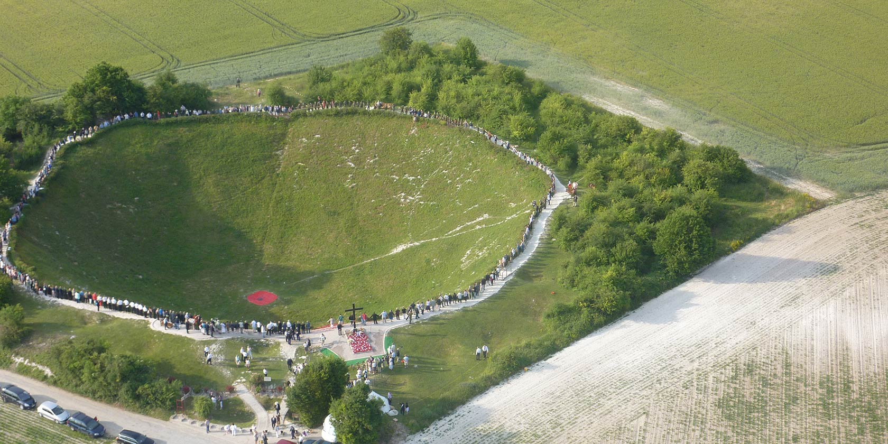
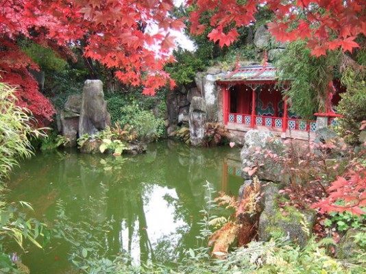
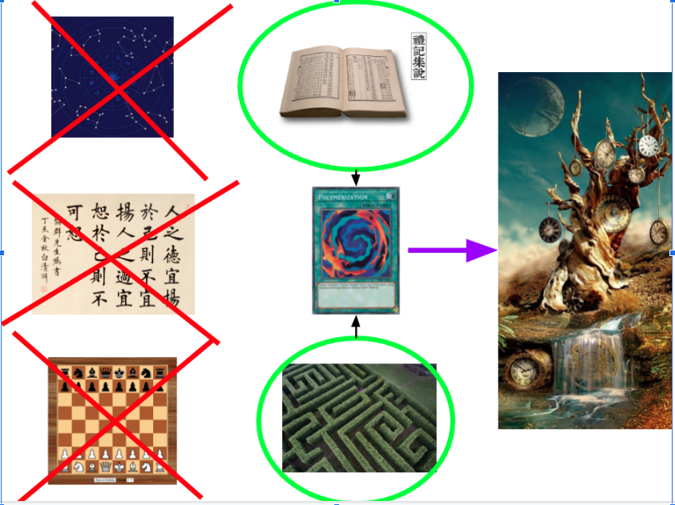

Cree una página web, elaborada principalmente con Markdown, que contenga elementos multimedia (no enlaces) para responder las siguientes preguntas:
===============================================
   a. ¿Cuál es el hecho histórico que desencadena la narrativa del cuento?
   -----------------------------------------------------------------------
   

   b. Ubica en el mapa dónde esta la locación secreta que se menciona al inicio del cuento.
   -----------------------------------------------------------------------
   
   
   
   c. ¿Qué relación tiene Lochnagar mine sobre el contexto histórico?
   -----------------------------------------------------------------------

   Lo que relata Borges, es el preludio a la batalla de Albert, que es la primera parte de la batalla de Somme
   esta batalla dejó un cratér que es el conocido **Lochnagar mine", inclusive actualmente todavía esta conservado
   y es accesible a público en general. Este cráter es un memento de esa batalla pero en aquel momento era una mina
   que los ingleses prepararon para los alemanes.

   

   d. ¿En que lugar en específico de Staffordshire se encuentra incialmente el protagonista?
   -----------------------------------------------------------------------
   e. La estación de tren de Ashgrove es ficticia pero por referencias se tiene certeza que era la estación de Trentham, coloque una imagen actual del sitio y describa un poco de la historia de esa estación.
   ----------------------------------------------------------------------- 

   La línea se construyó para servir a los jardines de Trentham, que el cuarto duque de Sutherland había donado recientemente al distrito del condado de Stoke-on-Trent.
   Durante la guerra, la Cámara de Compensación Central del Banco de Inglaterra fue evacuada de Londres a Trentham Hall  y los trenes de mercancías regulares corrieron a Trentham Park para entregar suministros y los trenes de excursión continuaron durante la guerra.

   
  f. ¿Cuál es la parada del tren donde se tendría que bajar actualmente para visitar al Sinólogo? 
  -----------------------------------------------------------------------------
  
  La estación de tren *Stock on Trent*

   
   

   -----------------------------------------------------------------------
  g. ¿De que se trata el libro Hung Lu Meng? 
  -----------------------------------------------------------------------

  La novela narra los desvelos amorosos de dos personajes excéntricos y apasionados.
  Aunque “Sueño en el Pabellón Rojo” es, en esencia, una historia de amor escrita, según afirma su autor “con palabras falsas y en lengua vulgar”, en realidad es mucho más que eso: es una crítica feroz a las contradicciones y miserias de una nobleza decadente que gobernaba la China de aquella época, y un manifiesto contra la codicia descontrolada y la falta de escrúpulos.

  h. ¿Cuál se cree es el jardín en que se inspiró Borges para este cuento?
  -----------------------------------------------------------------------

  Se dice que esta basado en el **Biddulph Grange Garden** ya que este tiene dentro de el varios jardines de distintos tiempos reflejando así el concepto de tiempo, además de que habla
  también de que Borges tal cual no conocía de primera mano este jardin sino que se dice que lo escucho de sus antepasados, el jardín que se anexa abajo tiene un estilo asiatico parecido al que se describe en la historia.

  

  i. Haz una breve semblanza de Ts'ui Pên.
  -----------------------------------------------------------------------

   Dejando de lado la astronomía, caligrafía, ajedrez, etc. Ts'ui Pên dedico 13 años
   en la creación de un libro y un laberinto, nunca diciendo que ambos eran uno solo
   y que hacían referencia a como el tiempo se bifurcaba como 
   las ramas de un arbol creando "historias alternas", así siendo un laberinto de interminables
   historias que sucedían en paralelo.
  

  j. Crea un avatar para cada personaje.
  -----------------------------------------------------------------------

  En orden de izquierda a derecha son el espia aleman de raíces chinas *Yu Tsun*, el sinólogo *Stephen Albert*,
  El bisabuelo de Yu Tsun y creador del Jardin *Ts'ui Pên*, el capitán *Richard Madden* y *el jefé de Yu Tsun*
  cuyo nombre y apariencia son desconocidos.  
  
  
  
  
  

  k. ¿Cuál puede ser la principal analogía del jardín de senderos que se bifurcan y el diseño de juegos?
  -----------------------------------------------------------------------  

  El hecho de crear un reto, como mencionan en la lectura, Ts'ui Pên creo la historia para que fuera una adivinanza, 
  y pues en el diseño de juegos de igual manera el creador tiene que presentar un desafio o un reto que no necesariamente
  tiene que ser una adivinanza y esto no quiere decir que las historias no tengan relevancia, la tienen porque plantan un contexto,
  permiten comunicar al autor ya sea del juego o a Ts'ui Pên de forma indirecta su ser. Pero no solo Ts'ui Pên sino también Borges
  puede comunicar o transmitir algo a través de esta lectura, puede intentar tergiversar la realidad o jugar a través de la noción
  del tiempo y el paralelismo que puede existir por lo menos a nivel hipótetico.

  **Galindo Arroyo Fernando Iván 150300107**
  
